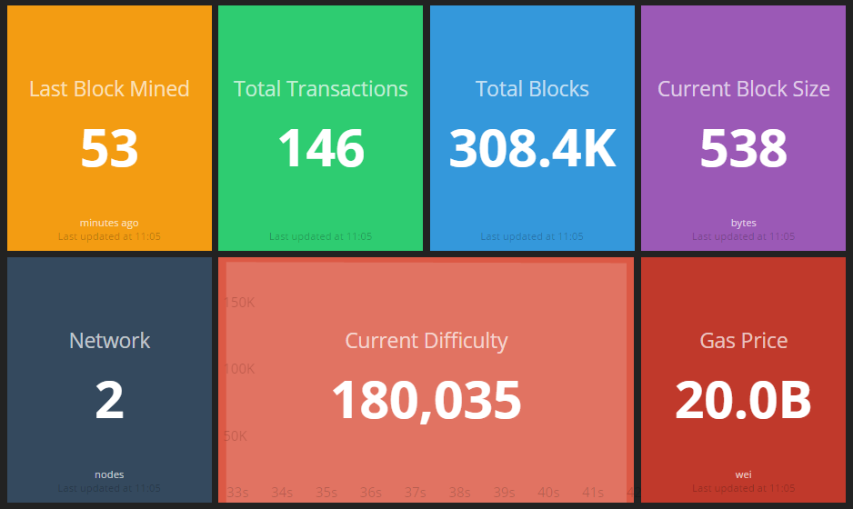

stats
=====

a sleek dashboard to display ethereum network statistics built with [dashing.io](https://dashing.io)

installing and running
----------------------

change the endpoints in [jobs](./jobs)
    
    gem install dashing
    bundle
    dashing start

point to [localhost:3030](http://localhost:3030)
